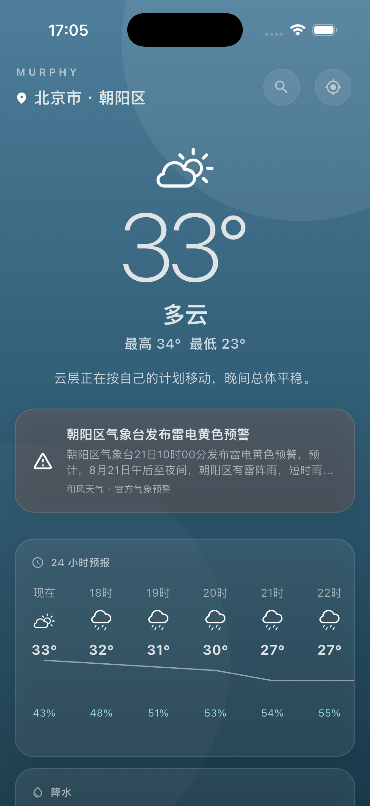
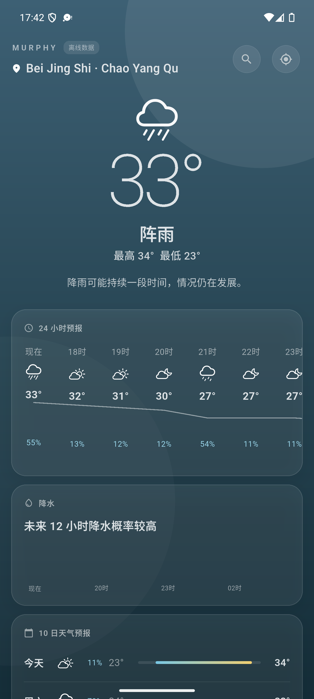

<p align="center">
  
</p>

<h1 align="center">Murphy</h1>

<p align="center">
  一款面向中国用户的精致天气应用。<br>
  在 Android 和 iOS 上快速查看实时天气、小时趋势、未来预报与官方气象预警。
</p>

<p align="center">
  <a href="https://github.com/shaominngqing/unweather/actions/workflows/ci.yml"></a>
  <a href="https://github.com/shaominngqing/unweather/releases/latest"></a>
  
  
</p>

<p align="center">
  <a href="https://github.com/shaominngqing/unweather/releases/latest"><strong>下载最新版本</strong></a>
  ·
  <a href="PRIVACY.md">隐私说明</a>
  ·
  <a href="CHANGELOG.md">更新记录</a>
</p>

## 运行截图

<table>
  <tr>
    <th align="center">iOS</th>
    <th align="center">Android</th>
  </tr>
  <tr>
    <td align="center"></td>
    <td align="center"></td>
  </tr>
</table>

> 截图中的天气、预警和地点均来自应用实际运行。天气会随地点与时间变化。

## 功能

- 真实定位：自动获取当前位置并解析中文城市、区县
- 城市搜索：搜索其他城市，并可一键返回当前位置
- 实时天气：当前温度、体感、最高最低温和天气概况
- 24 小时预报：逐小时天气、温度曲线与降水概率
- 降水趋势：集中展示未来 12 小时的降水变化
- 10 日预报：每日天气、温度区间与降水概率
- 官方预警：支持接入和风天气官方气象预警
- 丰富指标：空气质量、紫外线、日出日落、风向、湿度、露点、能见度、气压、降水量、云量和阵风
- 弱网可用：按地点保存缓存，启动时先展示最近数据并在后台刷新
- 原生体验：适配 Android、iOS 权限流程与安全区域

## 获取应用

前往 [Releases](https://github.com/shaominngqing/unweather/releases/latest) 下载最新版：

- `MurphyWeather-*-android.apk`：Android 设备直接安装
- `MurphyWeather-*-android.aab`：用于 Android 应用商店发布
- `MurphyWeather-*-ios-development.ipa`：开发签名 iOS 包，仅适用于签名中已登记的设备

iOS App Store 或 TestFlight 包需要 Apple Distribution 证书、发布描述文件与 App Store Connect 权限。

## 技术实现

- [Flutter](https://flutter.dev/)：Android 与 iOS 共享界面和业务逻辑
- [Open-Meteo](https://open-meteo.com/)：默认实时天气与预报数据
- [和风天气](https://www.qweather.com/)：可选的中国官方气象预警数据
- 本地缓存：按地点保存最近一次有效天气数据
- GitHub Actions：自动执行格式检查、静态分析、测试和正式构建

> Open-Meteo 免费 API 需要遵守其使用条款。商业发布前请确认数据授权与用量方案。

## 本地运行

### 环境要求

- Flutter `3.41.4` 或兼容的 stable 版本
- Android Studio / Android SDK，或 Xcode
- 一个 Android/iOS 设备或模拟器

```bash
flutter pub get
flutter devices
flutter run -d <设备ID>
```

未配置商业天气凭据时，核心天气功能仍可使用；官方预警会自动降级为不可用。

<details>
<summary><strong>配置和风天气官方预警</strong></summary>

请分别创建 iOS 与 Android 凭据，并在和风天气控制台设置应用限制和 API 限制。真实凭据只通过编译参数注入，不要写入源码。

创建不会提交到 Git 的配置文件：

`.secrets/qweather-ios.json`

```json
{
  "QWEATHER_API_HOST": "你的API_HOST",
  "QWEATHER_IOS_API_KEY": "你的iOS_API_KEY"
}
```

`.secrets/qweather-android.json`

```json
{
  "QWEATHER_API_HOST": "你的API_HOST",
  "QWEATHER_ANDROID_API_KEY": "你的Android_API_KEY",
  "QWEATHER_ANDROID_CERT_SHA1": "你的Android签名证书SHA-1"
}
```

运行 iOS：

```bash
flutter run -d <iOS设备ID> \
  --dart-define-from-file=.secrets/qweather-ios.json
```

运行 Android：

```bash
flutter run -d <Android设备ID> \
  --dart-define-from-file=.secrets/qweather-android.json
```

iOS 默认 Bundle ID 与 Android 默认包名均为 `com.murphyweather.murphy`。不要在同一次构建中传入两个平台的 API KEY，以免另一平台的凭据也进入安装包。

客户端参数仍可能被逆向读取，请务必在服务商控制台启用应用限制、API 限制和合理额度，并定期轮换凭据。

</details>

## 质量检查

```bash
dart format --output=none --set-exit-if-changed .
flutter analyze
flutter test
flutter build apk --debug
```

## 自动化发布

- 推送到 `master`：执行格式检查、静态分析与完整测试
- 推送与 `pubspec.yaml` 版本一致的标签，例如 `v1.0.0`：构建签名 Android APK/AAB、验证 iOS Release 构建并创建 GitHub Release
- Android 发布签名与平台凭据保存在 GitHub Actions Secrets，不进入仓库
- 每个发布产物都会同时生成 SHA-256 校验文件

发布流水线使用以下 GitHub Actions Secrets：

- `ANDROID_KEYSTORE_BASE64`
- `ANDROID_KEYSTORE_PASSWORD`
- `ANDROID_KEY_PASSWORD`
- `ANDROID_KEY_ALIAS`
- `QWEATHER_API_HOST`
- `QWEATHER_ANDROID_API_KEY`
- `QWEATHER_ANDROID_CERT_SHA1`
- `QWEATHER_IOS_API_KEY`

## 项目结构

```text
lib/
├── models/       # 天气与地点数据模型
├── screens/      # 主界面与交互
├── services/     # 定位、天气源、预警与缓存
└── widgets/      # 天气图标等复用组件

android/          # Android 工程与签名配置
ios/              # iOS 工程与隐私清单
test/             # 单元测试、组件测试与视觉回归测试
```

## 隐私

Murphy 仅在提供本地天气时请求定位权限。详细说明参见 [PRIVACY.md](PRIVACY.md)。
